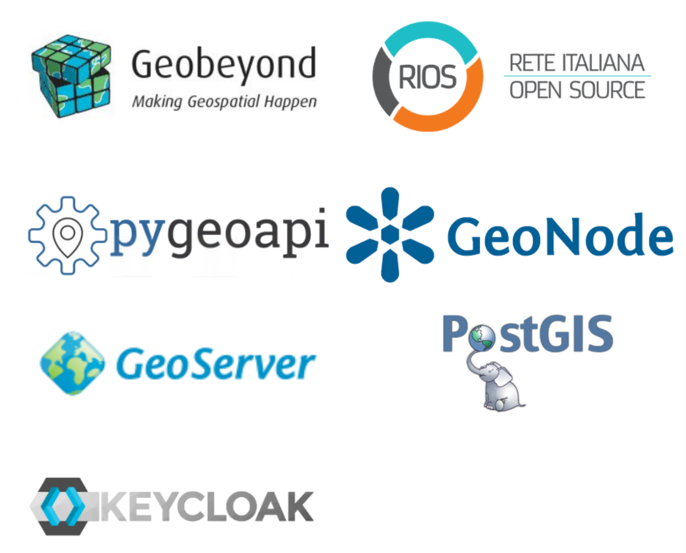

<!-- _paginate: hide -->

# Free geocoding in the cloud
**GeoCamp Zaragoza 2025**

---

## Who am I

- Luigi Pirelli
  - Since 2006 in QGIS/GRASS
  - QGIS Core developer and Plugin developer/trainer
  - Founder of GFOSS.it - Italian OSGEO Local Chapter
  - Founder of QGIS.es- Spanish QGIS user group
  - Now collaborating with
    - *GeoBeyond* www.geobeyond.it
    - *SaVE* - Electric Vehicle hacker ;)
  - https://www.linkedin.com/in/luigipirelli/

---

## GeoBeyond since 2011

- Services
  - Spatial Data Infrastructure
  - Access management configuration
- Client
  - [Rome Municipality](https://geoportale-preprod.comune.roma.it/georoma/#/)
  - [Politecnico di Milano](https://www.polimi.it/)
  - [ARPA Veneto](https://www.arpa.veneto.it/)
  - [Almaviva](https://www.almaviva.it/en_GB)
  - [NRCAN](https://natural-resources.canada.ca/) (<a class="small-text">Natural Resource Canada</a>)
  - and more...
- Enterprise support in:
  - GeoNode
  - pygeoapi (steering commettee)

---

## Goal

Official Italian portal DB update

- Geocode addresses <-------
- Fix addresses via field review
- Merge new or update addresses
- Update central DB

---

## Need geocoding

- QGIS plugin to geocode addresses
- integrate different geocoder via dynamic factories
- Free and Libre geocoder from OvertureMaps

---

## OvertureMaps ?

- [OvertureMaps](https://overturemaps.org/) as source of  geocoding
- feed from different sources among them OSM
- No API at all

---

## No API then locally use WhereAbouts

- - [DuckDB](https://duckdb.org/) based.... DUCKDB????
- In process not only spatial DB
- DuckDB thedn could be natevely cloud
- BUT no cloud actually.... or not?

---

## no more local now cloud

- How to in https://github.com/ajl2718/whereabouts/issues/13
- Extract data from OvertureMap
- Populate WhereAbout DuckDB
- Put DB somewhere (my PR https://github.com/ajl2718/whereabouts/pull/16)
- Geocode!

---

## Questions?

---

**Contacts**
  Luigi Pirelli
    luigi.pirelli@geobeyond.it
    https://www.linkedin.com/in/luigipirelli/
  Geobeyond
    info@geobeyond.it
    [www.geobeyond.it](http://www.geobeyond.it)
